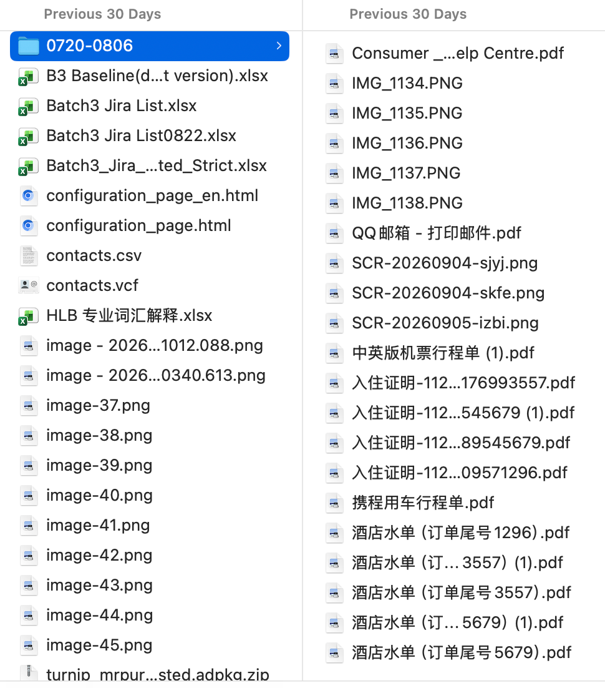
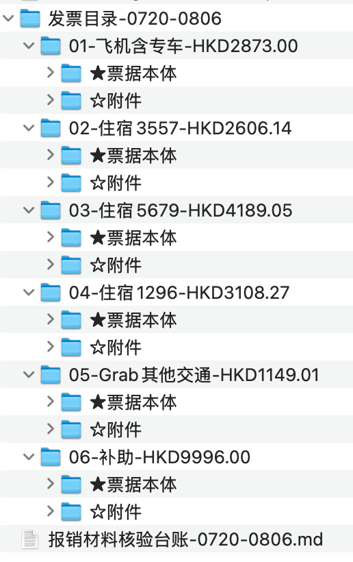
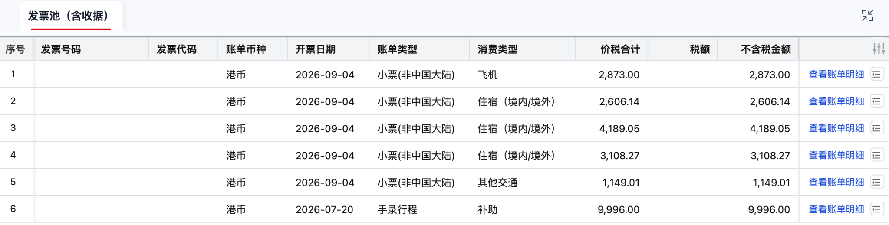
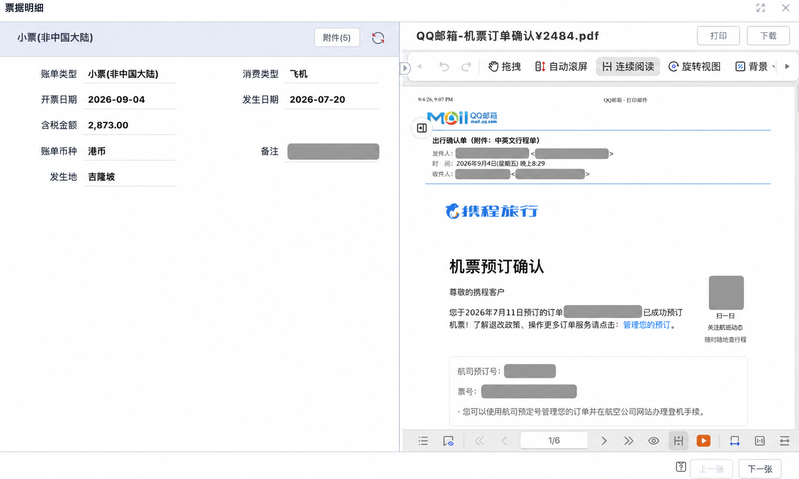

# 差旅报销自动化 Skills

这套工作流面向 WorkBuddy / Codex，分两步处理差旅报销材料：先在本地整理、核验并归档凭证，再把确认后的结果录入用友云（YonBIP）发票池。

仓库中有两个前后衔接的 skill：

| Skill | 版本 | 负责什么 | 不负责什么 |
|---|---:|---|---|
| [`invoice-organizer`](./invoice-organizer/) | 1.3.0 | 识别凭证、分类归档、缺料检查、金额勾稽、Grab 私人行程确认、补助计算与核验台账 | 未经确认不整理文件；默认不提交报销单 |
| [`yonyou-invoice-pool`](./yonyou-invoice-pool/) | 0.2.0 | 读取已归档目录，生成录入计划，并通过 Tabbit 将账单与附件录入一个用友发票池票袋 | 不填报销单表头、不关联事项、不提交 |

两个 skill 都会先给出预览，等用户确认后再整理文件或操作平台。它们只处理下文列出的凭证和发票池录入步骤，不代替完整的财务或报销流程。

## 能解决什么问题

### 1. 把散乱凭证整理成可复核目录

把携程订单凭证（飞机、酒店、专车）、Grab 官方行程单、支付记录和汇率截图放进同一个本地文件夹。`invoice-organizer` 会：

- 识别文件类型并按报销行分类；
- 检查缺失材料，提示需要补充的汇率或配套凭证；
- 勾稽订单、支付记录和对账单金额，必要时重新进行 OCR 复核；
- 列出疑似私人 Grab 行程，交由用户决定是否排除；
- 按工作日计算出差补助，展开每日明细，并标记法定节假日；
- 先生成《报销材料核验台账》，得到确认后才复制、归档和重命名文件。

目前只覆盖以下五类材料：

1. 携程飞机票
2. 携程酒店
3. 携程专车
4. Grab 流水
5. 出差补助

签证费、餐饮发票、地铁票等其他类型尚未纳入默认规则。

### 2. 把核验结果录入用友发票池

完成归档后，`yonyou-invoice-pool` 会解析标准目录，生成《票袋录入计划》。用户确认计划后，它通过 Tabbit：

- 在用友“发票池（含收据）”中创建票袋；
- 逐行填写账单字段；
- 上传票据本体和附件；
- 回读并复核已录入数据；
- 输出交付台账和报告。

它只负责发票池票袋，不会替用户提交报销单。

## 工作流

```text
原始凭证文件夹
    ↓ invoice-organizer
核验台账（等待用户确认）
    ↓
标准化发票目录
    ↓ yonyou-invoice-pool
票袋录入计划（等待用户确认）
    ↓ Tabbit + 已登录的 YonBIP
发票池票袋 + 复核台账
    ↓
用户手工从票袋拉取记录并完成报销单
```

## 效果展示

### Skill 1：整理前后

| 整理前 | 整理后 |
|---|---|
|  |  |

### Skill 2：发票池录入





仓库中的截图已对姓名、邮箱、订单号、订座号、票号、二维码和路线等识别信息进行脱敏。

## 环境要求

- WorkBuddy 或 Codex，且支持本地 skills；
- Python 3.9+；
- Tabbit 浏览器与 `tabbit-cli`（仅录入用友发票池时需要）；
- 已登录且有权限访问的 YonBIP 账号（仅 Skill 2 需要）。

## 安装

### Codex

```bash
git clone https://github.com/tolyer/invoice-reimbursement-skills.git
cp -R invoice-reimbursement-skills/invoice-organizer ~/.codex/skills/
cp -R invoice-reimbursement-skills/yonyou-invoice-pool ~/.codex/skills/
```

### WorkBuddy

```bash
git clone https://github.com/tolyer/invoice-reimbursement-skills.git
cp -R invoice-reimbursement-skills/invoice-organizer ~/.workbuddy/skills/
cp -R invoice-reimbursement-skills/yonyou-invoice-pool ~/.workbuddy/skills/
```

安装后新开一个会话，让应用重新加载 skills。

也可以直接从 GitHub 下载整个仓库的 ZIP，再把两个 skill 目录复制到相应的 skills 目录。

## 使用示例

先整理凭证：

```text
帮我整理 ~/Downloads/0720-0806 里的发票，行程是 7/20 至 8/6 的吉隆坡出差。
```

检查台账并补齐材料后：

```text
确认台账，开始归档。
```

再录入发票池：

```text
用 yonyou-invoice-pool 把“发票目录-0720-0806”录成票袋“0720-0806吉隆坡差旅”。
```

## 重要说明

- 两个 skill 的规则带有组织和租户特征。使用前请检查汇率来源、补助标准、节假日日历、用友字段口径和页面入口是否适用于你的环境。
- `yonyou-invoice-pool` 中记录的选择器和入口来自特定租户的实测界面；用友升级或切换租户后可能需要适配。
- 请勿把真实发票、行程单、邮箱打印件、票号、订单号或生成的核验台账提交到本仓库。
- 本项目为个人工作流工具，与用友、携程、Grab、WorkBuddy 或 Codex 官方无隶属或背书关系。

更详细的材料清单、口径和命令见 [`invoice-organizer/README.md`](./invoice-organizer/README.md) 与 [`yonyou-invoice-pool/安装说明.md`](./yonyou-invoice-pool/安装说明.md)。
