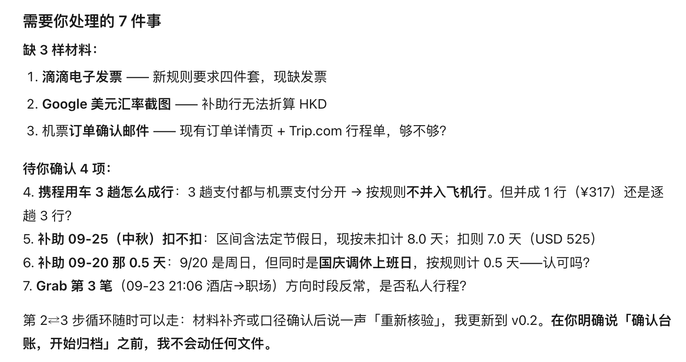
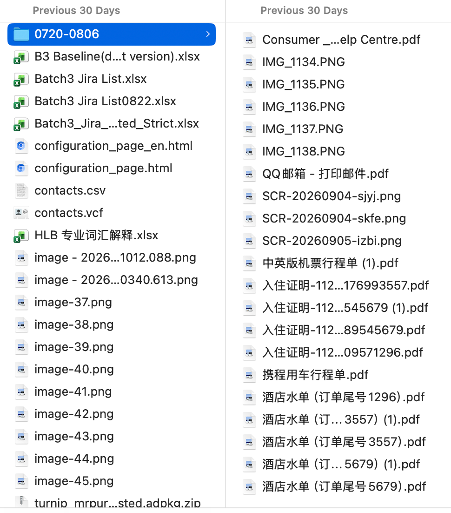
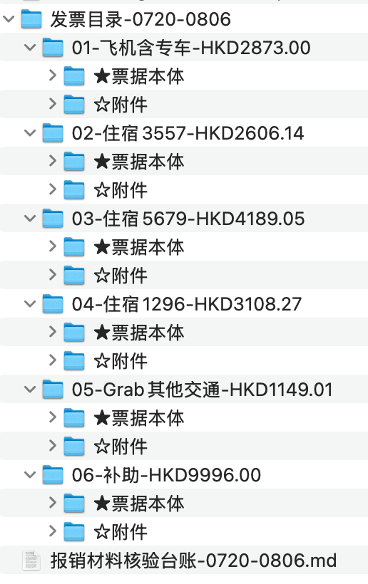
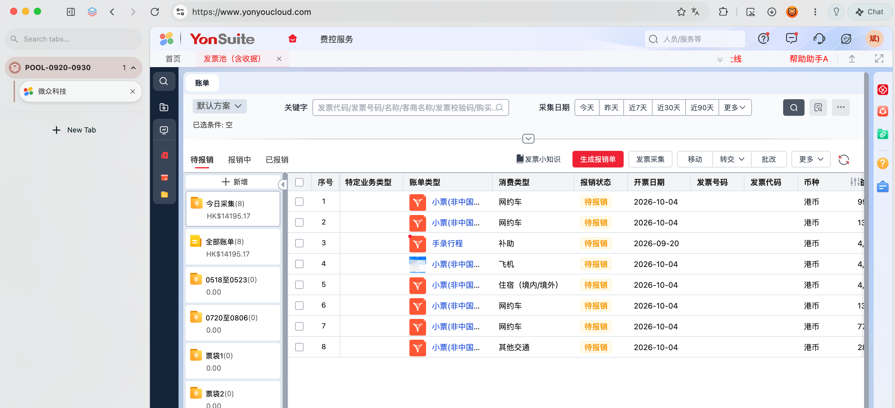
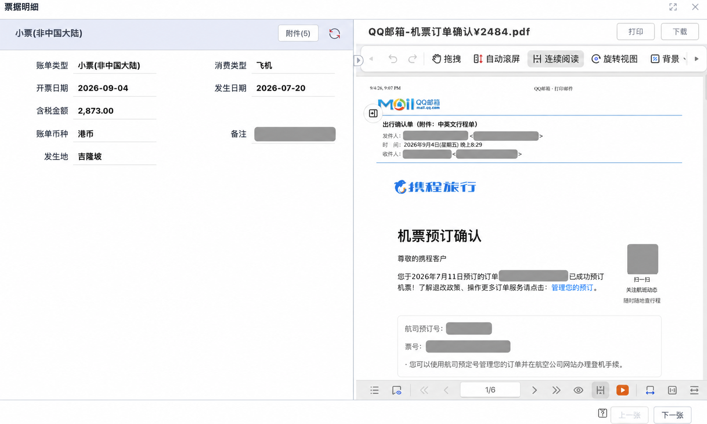

# 差旅报销自动化 Skills

面向 WorkBuddy / Codex 的两阶段差旅报销工作流：先整理和核验本地凭证，再把确认后的结果录入用友云（YonBIP）发票池。

> 两个 skill 都会先生成预览，等用户确认后再整理文件或操作平台。它们不代替完整的财务审批流程，也不会替用户提交报销单。

## 仓库内容

| Skill | 当前版本 | 用途 | 操作边界 |
|---|---:|---|---|
| [`invoice-organizer`](./invoice-organizer/) | **1.8.0** | 识别凭证、检查缺料、勾稽金额、计算补助并生成核验台账 | 未确认前不整理文件；归档时只复制原文件 |
| [`yonyou-invoice-pool`](./yonyou-invoice-pool/) | **0.3.0** | 读取标准目录，生成录入计划，并把账单与附件录入一个用友发票池票袋 | 不填报销单表头、不关联事项、不提交 |

## 工作流

```text
原始凭证文件夹
    ↓ invoice-organizer
核验台账（等待用户确认）
    ↓
标准化发票目录
    ↓ yonyou-invoice-pool
票袋录入计划（等待用户确认）
    ↓ Tabbit + 已登录的 YonBIP
发票池票袋 + 复核台账
    ↓
用户从票袋拉取记录并完成报销单
```

## Skill 1：整理与核验凭证

把凭证、支付记录和汇率截图放进同一个本地文件夹，`invoice-organizer` 会：

- 打开文件检查实际内容，不依赖文件名前缀判断类型；
- 按报销行分类，检查缺失材料和金额差异；
- 对携程退款、机票改签及两者同时出现的订单做专项勾稽，同一订单只生成一行净额；
- 列出疑似私人 Grab 行程，交由用户决定是否排除；
- 逐日计算出差补助；遇到周末、法定节假日或模糊的加班答复时，列出日期请用户确认；
- 先生成《报销材料核验台账》，确认后再复制、归档和重命名文件，并附归档清单与必要的逐笔台账。

遇到缺料、口径冲突或疑似私人行程时，它会把问题集中列出，不会直接动原文件：



目前支持七类材料：

| 类别 | 主要材料 |
|---|---|
| 携程飞机票 | 订单确认邮件或订单详情、中英版行程单、支付截图；如有退款，按净额核验 |
| 携程机票改签 | 改签发票、费用详情、新旧航班、逐笔支付、改签后行程单；如同时退款，合并到同一订单 |
| 携程酒店 | 酒店水单、入住证明、支付截图 |
| 携程专车 | 用车行程单、支付记录；是否并入飞机行由金额勾稽决定 |
| 滴滴用车 | 行程报销单、电子发票、费用说明和支付截图；高速费单独勾稽 |
| Grab 流水 | Grab Member Statement 对账单；[查看官方获取方法](https://help.grab.com/passenger/en-my/360038782911-How-to-find-my-Grab-transaction-history) |
| 出差补助 | 行程日期、日标准和 USD→HKD 汇率截图 |

签证费、餐饮发票、地铁票等其他类型尚未纳入默认规则。

## Skill 2：录入用友发票池

完成归档后，`yonyou-invoice-pool` 会解析标准目录并生成《票袋录入计划》。用户确认后，它通过 Tabbit：

- 创建并命名发票池票袋；
- 逐行填写账单字段，上传票据本体和附件；消费类型、日期、币种与关键字段都要回读确认；
- 回读已录入的数据，输出复核台账和交付报告。

这个 skill 只处理发票池票袋。报销单表头、事项关联和最终提交仍由用户完成。

## 效果展示

### 整理前后

| 整理前 | 整理后 |
|---|---|
|  |  |

### 发票池录入






## 环境要求

- WorkBuddy 或 Codex，且支持本地 skills；
- Python 3.9+；
- Tabbit 浏览器——美团出品的AI 浏览器，原生自带 CLI，可以节省 Token；推荐大家使用我的邀请链接下载 https://web.tabbit.ai/activity/invite/F1E33DB4?k=gvACADsb6ta4ADqt2lQmADcQNw
- 已登录且有权限访问的 YonBIP 账号（仅 Skill yonyou-invoice-pool 需要）。

## 安装

先克隆仓库：

```bash
git clone https://github.com/tolyer/invoice-reimbursement-skills.git
```

安装到 Codex：

```bash
cp -R invoice-reimbursement-skills/invoice-organizer ~/.codex/skills/
cp -R invoice-reimbursement-skills/yonyou-invoice-pool ~/.codex/skills/
```

安装到 WorkBuddy：

```bash
cp -R invoice-reimbursement-skills/invoice-organizer ~/.workbuddy/skills/
cp -R invoice-reimbursement-skills/yonyou-invoice-pool ~/.workbuddy/skills/
```

安装后新开一个会话，让应用重新加载 skills。也可以[下载仓库 ZIP](https://github.com/tolyer/invoice-reimbursement-skills/archive/refs/heads/main.zip)，再把两个 skill 目录复制到对应的 skills 目录。

## 快速使用

### 1. 整理凭证

```text
帮我整理 ~/Downloads/0720-0806 里的发票，行程是 7/20 至 8/6 的吉隆坡出差。
```

检查核验台账并补齐材料后：

```text
确认台账，开始归档。
```

### 2. 录入发票池
先使用 tabbit 浏览器登录用友平台，然后在 Workbuddy/Codex 给出指令：

```text
用 yonyou-invoice-pool 把“发票目录-0720-0806”录成票袋“0720-0806吉隆坡差旅”。
```
- 注意，此命令会消耗较多 token 优先推荐使用 WorkBuddy 来跑。
- 完成后，再手工接管 Tabbit 浏览器标签页，创建报销单→从票袋导入明细→选中已经自动导入的发票记录
- 你会发现一切都勾稽得非常完美，可以直接提单。


## 版本记录

以下记录合并自两个 skill 的 CHANGELOG，按时间倒序排列。完整改动和影响范围见 [`invoice-organizer/CHANGELOG.md`](./invoice-organizer/CHANGELOG.md) 与 [`yonyou-invoice-pool/CHANGELOG.md`](./yonyou-invoice-pool/CHANGELOG.md)。

| 日期 | Skill | 版本 | 主要修订 |
|---|---|---:|---|
| 2026-10-04 | `invoice-organizer` | **1.8.0** | 补齐“改签 + 退款”混合场景：同一订单只出一行净额；识别改签后主动核对必需材料，缺什么就明确提醒。 |
| 2026-10-04 | `invoice-organizer` | **1.7.0** | 新增携程机票改签：区分发票总额、行程单金额和改签新增费用，并要求先确认报整单还是只报新增部分。 |
| 2026-10-04 | `invoice-organizer` | **1.6.1** | 对“这几天上班”等模糊答复先确认具体日期；答复后同步回写台账、金额和归档目录。 |
| 2026-10-04 | `invoice-organizer` | **1.6.0** | 新增周末、节假日加班确认；生成补助逐日台账，并作为补助行附件归档。 |
| 2026-10-04 | `invoice-organizer` | **1.5.0** | 归档目录改放在原始凭证目录内；新增归档清单、Grab 逐笔台账和关键文件 MD5 抽检。 |
| 2026-10-04 | `invoice-organizer` | **1.4.2** | 反向汇率仍可反算，但必须取得用户二次确认或直接报价截图后才能折算与归档。 |
| 2026-10-04 | `invoice-organizer` | **1.4.1** | 补充反向汇率换算、滴滴高速费口径，并修正 Grab 上下车地点容易读反的问题。 |
| 2026-10-04 | `invoice-organizer` | **1.4.0** | 新增滴滴用车；加入携程退款净额与滴滴高速费两套金额勾稽规则。 |
| 2026-10-04 | `yonyou-invoice-pool` | **0.3.0** | 完成 8 行真实票袋实跑；修正网约车归类和台账识别，改用 `fieldid` 定位字段，并补充日历、单选与币种回读规则。 |
| 2026-09-28 | `invoice-organizer` | **1.3.1** | 汇率截图改为按内容识别，不再要求 `SCR-` 前缀；所有未归类图片都要逐张确认。 |
| 2026-09-07 | `invoice-organizer` | **1.3.0** | 出差补助改为按工作日计算；新增节假日日历、逐日计算脚本和节假日复核提醒。 |
| 2026-09-06 | `yonyou-invoice-pool` | **0.2.0** | 根据 YonBIP 实测界面修正票袋创建、手工录入和删除入口；补充安装说明，并修复压缩包中文文件名乱码。 |
| 2026-09-06 | `invoice-organizer` | **1.2.0** | 专车是否并入飞机行改为按支付金额勾稽判定，分开支付时分别成行。 |
| 2026-09-06 | `invoice-organizer` | **1.1.0** | 新增用户使用手册，补齐材料清单、命令速查、产出结构和完整对话示例。 |
| 2026-09-05 | `invoice-organizer` | **1.0.1** | 修复汇率截图凭文件名猜测币种的问题，加入视觉确认、映射表和用户确认步骤。 |
| 2026-09-05 | `yonyou-invoice-pool` | **0.1.0** | 建立独立票袋工作流，加入目录扫描、字段口径、复核交付和断点续录设计。 |
| 2026-09-05 | `invoice-organizer` | **1.0.0** | 首个版本：五类凭证、核验台账、确认后归档，以及可维护的识别和勾稽规则。 |

## 使用边界与隐私

- 两个 skill 的规则带有组织和租户特征。使用前请核对汇率来源、补助标准、节假日日历、用友字段口径和页面入口。
- `yonyou-invoice-pool` 中的入口和选择器来自特定租户的实测界面；用友升级或切换租户后可能需要适配。
- 不要把真实发票、行程单、邮箱打印件、票号、订单号或生成的核验台账提交到本仓库。
- 本项目是个人工作流工具，与用友、携程、Grab、WorkBuddy 或 Codex 官方无隶属或背书关系。

更详细的材料要求和操作口径见 [`invoice-organizer/README.md`](./invoice-organizer/README.md) 与 [`yonyou-invoice-pool/安装说明.md`](./yonyou-invoice-pool/安装说明.md)。
